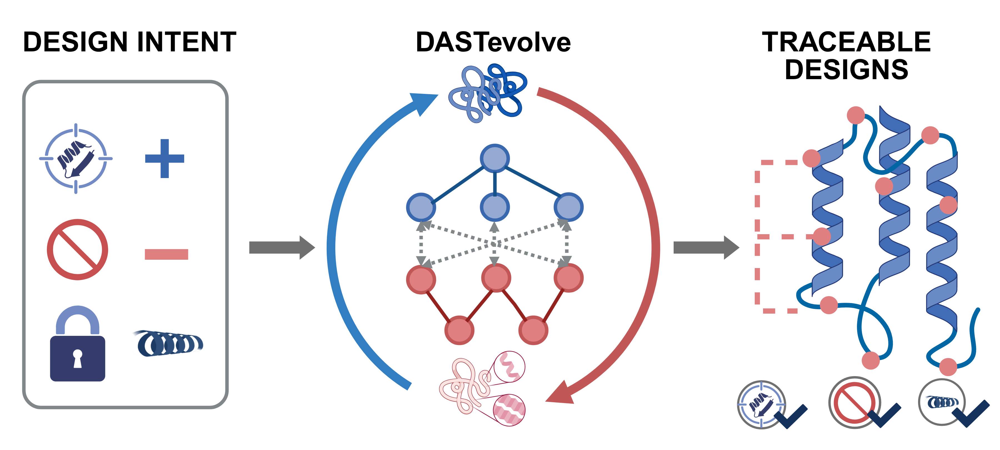

# DASTevolve

<p align="center">
  
</p>

DASTevolve is a Dual Abstract Syntax Tree (Dual-AST) protein-design framework with an LLM-guided outer loop and a MCTS inner search loop.
This repository contains the core runtime, a teaching demo, case studies, and a practical guide for configuring a new case.

## Requirements

- Linux
- Mamba (the environment file is also Conda-compatible)
- An NVIDIA CUDA-capable GPU with a driver compatible with CUDA 12.8 for
  GPU-backed model execution
- An OpenAI-compatible LLM endpoint
- External model installations required by the selected case

The environment file installs Python 3.12 and the official PyTorch 2.9.1
CUDA 12.8 wheel.

The installation and dry-run checks do not execute an LLM, sequence model, or
structure model. A GPU is required only when a configured case invokes a
GPU-backed model.

## Install with Mamba

```bash
git clone https://github.com/YiyangZHA0/DASTevolve.git
cd DASTevolve
mamba env create -f environment.yml
mamba activate DASTevolve
cp configs/env.example .env.local
```

To update an existing `DASTevolve` environment after pulling code changes:

```bash
mamba env update -n DASTevolve -f environment.yml
mamba activate DASTevolve
```

Configure the LLM in `.env.local`:

```bash
export ASTEVOLVE_LLM_API_BASE="https://your-endpoint.example/v1"
export ASTEVOLVE_LLM_API_KEY="your-key"
export ASTEVOLVE_LLM_MODEL="your-model"
```

Configure shared external roots in `.env.local`. Keep model weights, tools,
datasets, credentials, temporary files, and run outputs outside the repository.
`configs/env.example` is the complete configuration reference; enable only the
backends required by the selected case.

```bash
export ASTEVOLVE_PROJECT_ROOT="${PWD}"
export ASTEVOLVE_RUNTIME_ROOT="${ASTEVOLVE_PROJECT_ROOT}/../DASTevolve_runtime"
export ASTEVOLVE_DATA_ROOT="${ASTEVOLVE_RUNTIME_ROOT}/datasets"
export ASTEVOLVE_MODEL_ROOT="${ASTEVOLVE_RUNTIME_ROOT}/models"
export ASTEVOLVE_TOOL_ROOT="${ASTEVOLVE_RUNTIME_ROOT}/tools"
export ASTEVOLVE_ARTIFACT_ROOT="${ASTEVOLVE_RUNTIME_ROOT}/runs"
export ASTEVOLVE_RUN_ROOT="${ASTEVOLVE_ARTIFACT_ROOT}"
export ASTEVOLVE_TMP_ROOT="${ASTEVOLVE_RUNTIME_ROOT}/tmp"
```

## Validate installation

Verify dependency consistency, CUDA visibility, and the packaged cases:

```bash
python -m pip check
python -c "import torch; print(torch.__version__, torch.version.cuda, torch.cuda.is_available())"
bash scripts/check_install.sh
bash scripts/run_case.sh tiam1 --iterations 2 --dry-run
```

`pip check` should report no broken requirements, and
`torch.cuda.is_available()` should print `True` on a configured GPU machine.
The packaged check validates the demo and Tiam1 manifests, launchers, and Tiam1
strict preflight without calling an LLM, sequence model, or structure model.

This installation path has been validated with Python 3.12.13,
PyTorch 2.9.1+cu128, CUDA 12.8, and an NVIDIA A100 GPU.

Run the teaching demo or the Tiam1 case used in our case study:

```bash
bash scripts/run_case.sh demo --iterations 1
bash scripts/run_case.sh tiam1 --iterations 100
```

Outputs are written outside the repository under
`${ASTEVOLVE_RUNTIME_ROOT}/runs` unless `--output PATH` is provided.

## How to create a new case

Copy `cases/demo_case/` to a new directory and update these files:

- `case.json`: set the case ID and the entry program, configuration, and
  evaluator paths.
- `case_sheet.json`: describe the scientific objective, success and failure
  signals, and hypotheses.
- `design_state.json`: define complete chain sequences, zero-based half-open
  mutable spans, fixed residues, the Functional AST, the Structural AST, and
  mapping edges.
- `initial_program.py`: define the LLM-editable Node and amino-acid policy and
  the locked GPU funnel.
- `*_evaluator.py`: define normalized metrics, weights, missing-data policies,
  and immutable hard gates.
- `memory.yaml`: provide read-only seed knowledge. Learned memory is written
  to the runtime output directory.
- `config.yaml`: configure the LLM, specialist islands, generation barrier,
  and memory policy.

Add an alias for the new directory in `scripts/run_case.sh`, then validate it:

```bash
python scripts/preview_case.py --manifest cases/your_case/case.json
python scripts/check_assets.py --manifest cases/your_case/case.json
python scripts/run_outer.py \
  --manifest cases/your_case/case.json \
  --iterations 2 \
  --output "${ASTEVOLVE_RUNTIME_ROOT}/runs/your_case_validation"
```

For a formal case that should meet the same readiness policy, also
declare `recorded_evidence_path` and `preflight` in `case.json`, then run:

```bash
python scripts/case_preflight.py run \
  --manifest cases/your_case/case.json \
  --report /tmp/your_case_preflight.json
python scripts/case_preflight.py verify \
  --manifest cases/your_case/case.json \
  --report /tmp/your_case_preflight.json
```

Case files must use relative paths only. Inject model locations, databases,
licensed tools, and credentials through environment variables.

PyRosetta/Rosetta, getContacts, ESMFold2, and AlphaFold 3 remain optional
backends. Check their availability with:

```bash
python scripts/check_physics_backends.py
```

Users can add and configure their own backends as needed.
